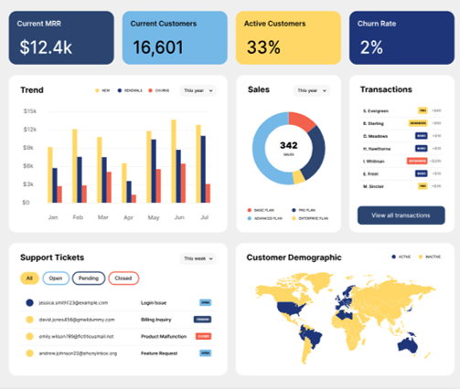
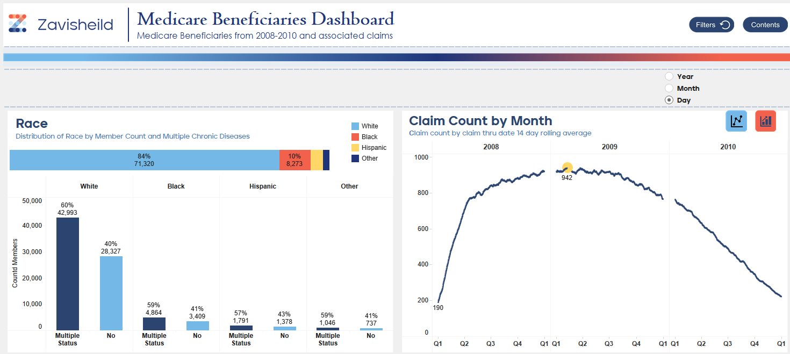
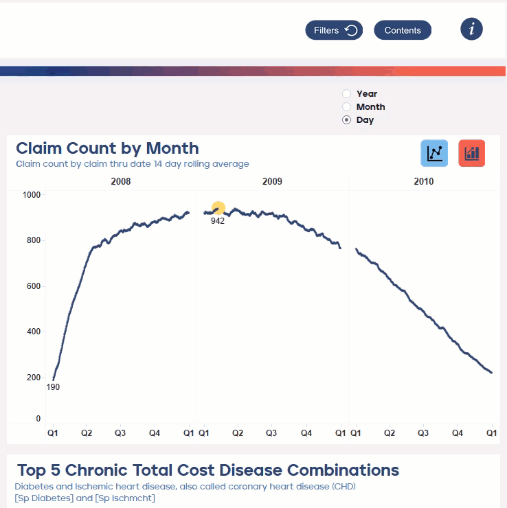

# OUTPATIENT CLAIMS BENEFICIARIES CMS PUBLIC DATA

### **Introduction**
User documentation
https://www.cms.gov/data-research/statistics-trends-and-reports/medicare-claims-synthetic-public-use-files

## **DATA**
1. Datasource 1: Out Patient Claim Sample
2. Datasource 2: Beneficiary Summary File
Locations of datasources at Documentation/Technical Skills Interview Task.xlsx

## **STEPS**

### **1. Outpatient Claims**
 * Ingested using alteryx, visually inspected column names and data missingness. Removed cols that are completely null, white spaces. 
 * Removed blank providersChanged yyyymmdd to date in sql for the one OPC i ingested into MSSQL Server. 
 * Used CTEs and partitions to find countd member per provider/disease combination (PPDC), sum paid amt PPDC, sum paid amt for amt for a provider.
 * Inner joined to Benefit summary to get disease combination concatenated along with race, age etc. 3 dupes ignored

### **2. Beneficiary Summary**
* Kept data source in csv and changed yyyymmdd to date in tableau for the CSV i didnt ingest into a DB
* 
* recoded 1 yes to 1 and 2 no to 0
* Joined to OPC
* Created unpivot of Benefit table to get list of members and their diseases whether or not they had more than 1 for question 5. put in MS SQL
* Excluded Provider blanks

### **3. Tableau**

* Used inner joined table to make Outpatient_BS_Reporting and used this for tableau reporting
* used Naviguard website to copy colours and fonts and downloaded similar fonts where couldnt find them using webpage inspect html, used https://coolors.co/generate to create a palette for tableau
* added palette to My Tableau Repository, and shapes with palette
* assumed race codes w/o reading the manual in too much detail

## Examples
Item | Description | 
------------ | ------------- | 
|Here is an example of a dashboard using the Demo colour palette|
|Tableau public dashbord example of multiple chronic diseases with fonts and colour palette and parameter to change date breakdown|
|Info button and functionality|